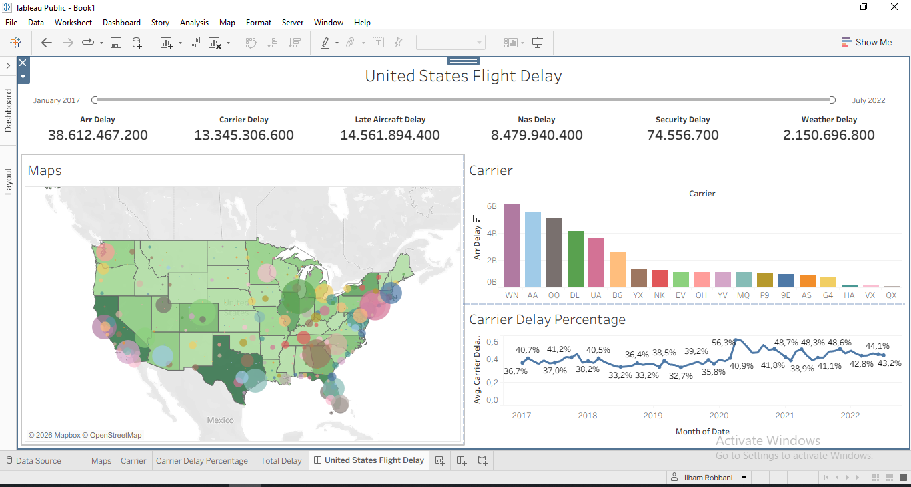

# United States Flight Delay Trend Analysis

## Project Overview

An analysis of more than 100,000 flight delay records to identify trends and patterns in United States airline performance from 2017–2022.

The project focuses on understanding flight delay patterns, comparing carrier performance, and analyzing the major causes of flight delays using Microsoft Excel and Tableau.

## Business Problem

What factors contribute most to flight delays across the United States?

Understanding flight delay patterns can help identify major delay causes and provide insights into airline operational performance.

## Objectives

- Analyze flight delay trends from 2017–2022.
- Identify patterns in flight delays across different carriers.
- Analyze the geographical distribution of flight delays across the United States.
- Identify major causes contributing to flight delays.
- Present the analysis through an interactive Tableau dashboard.

## Dataset

The dataset used in this project was obtained from Kaggle.

- **Source:** [Kaggle - Flight Delay from January 2017 - July 2022](https://www.kaggle.com/datasets/jawadkhattak/us-flight-delay-from-january-2017-july-2022)
- **Period:** January 2017 – July 2022
- **Location:** United States
- **Records:** 100,000+

## Tools

- Microsoft Excel
- Tableau

## Data Preparation

Microsoft Excel was used to clean and prepare the raw airline delay dataset before analysis and visualization.

The preparation process included reviewing the dataset structure, checking data quality, and preparing the data for further analysis.

## Analysis

The analysis focused on:

- Flight delay trends over time.
- Carrier performance.
- Geographical distribution of delays.
- Carrier-related delays.
- Weather-related delays.
- NAS-related delays.
- Late aircraft delays.
- Security-related delays.

## Dashboard

An interactive Tableau dashboard was developed to monitor flight delay metrics, carrier performance, and geographical delay distributions across the United States.

## Key Insights

- Late Aircraft Delay was the largest delay category, contributing approximately 14.56 billion minutes of accumulated delay, followed by Carrier Delay at 13.35 billion minutes.

- WN recorded the highest total accumulated arrival delay at approximately 6.2 billion minutes, followed by AA and OO.

- Carrier delay percentage generally ranged between approximately 33% and 44% during 2017–2019, before reaching a peak of 56.3% in 2020.

- Weather and security-related delays contributed substantially less to total accumulated delay compared with late aircraft, carrier, and NAS-related delays.

## Project Outcome

The project demonstrates the end-to-end data analysis process, from raw data preparation and cleaning to exploratory analysis, visualization, dashboard development, and insight generation.

It also demonstrates the use of Microsoft Excel and Tableau to transform a large dataset into a more accessible and informative analytical dashboard.
